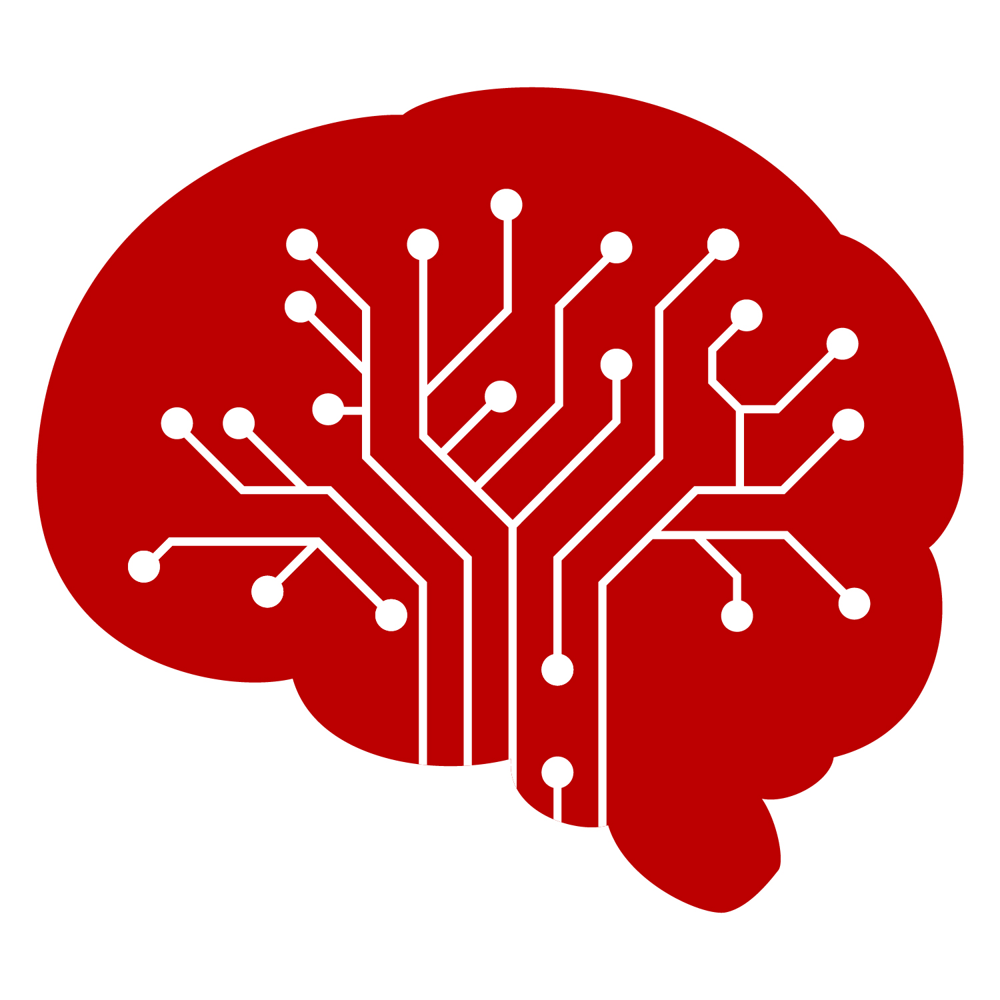
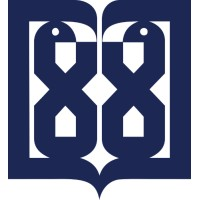
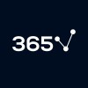

<!-- 




 -->

# About Me  
I am **Shayan Kebriti**, a Computer Engineering undergraduate at Shahid Beheshti University in Tehran, Iran.  
My research interests include **Machine Learning**, **Computer Vision**, **Medical Image Computing**, and **Graph Neural Networks**.  
I am open to working on projects in these areas and I would love to contribute. I am also seeking **Master’s** or **PhD** opportunities.  

*Email:* [shayankebriti@gmail.com](mailto:shayankebriti@gmail.com)

# Publications

  

    
      Under Review (
      <a href="https://www.scimagojr.com/journalsearch.php?q=17271&tip=sid" target="_blank">
        Medical Image Analysis
      </a>)
    
    
  

  

    <h3 class="pub-title">FractMorph: A Fractional Fourier-Based Multi-Domain Transformer for Deformable Image Registration</h3>

    

      <strong>Shayan Kebriti</strong>1,
      Shahabedin Nabavi1
      <a href="https://scholar.google.com/citations?user=D_mPA6sAAAAJ" target="_blank" aria-label="Nabavi Google Scholar">
        🎓
      </a>,
      Ali Gooya2,3
      <a href="https://scholar.google.com/citations?user=H7w9icgAAAAJ" target="_blank" aria-label="Gooya Google Scholar">
        🎓
      </a>
    

    

      <a class="pub-chip" href="https://arxiv.org/abs/2508.12445" target="_blank" rel="noopener">
        arXiv
      </a>
      <a class="pub-chip" href="https://arxiv.org/pdf/2508.12445" target="_blank" rel="noopener">
        Paper (PDF)
      </a>
      <a class="project-gh" href="https://github.com/shayankebriti/FractMorph" target="_blank" rel="noopener">
        <svg viewBox="0 0 16 16" aria-hidden="true">
          <path d="M8 .2a8 8 0 0 0-2.53 15.6c.4.08.55-.17.55-.38l-.01-1.33c-2.25.49-2.72-1.09-2.72-1.09-.36-.93-.88-1.18-.88-1.18-.72-.5.05-.49.05-.49.79.06 1.2.83 1.2.83.71 1.2 1.86.85 2.31.65.07-.52.28-.85.5-1.05-1.8-.2-3.69-.9-3.69-3.98 0-.88.31-1.6.82-2.16-.08-.2-.36-1.01.08-2.11 0 0 .67-.22 2.2.82A7.7 7.7 0 0 1 8 3.87c.68 0 1.36.09 2 .26 1.53-1.04 2.2-.82 2.2-.82.44 1.1.16 1.91.08 2.11.51.56.82 1.28.82 2.16 0 3.1-1.9 3.78-3.71 3.98.29.25.54.73.54 1.48l-.01 2.2c0 .21.15.46.55.38A8 8 0 0 0 8 .2z"/>
        </svg>
        GitHub
      </a>
    

    

      FractMorph is a novel 3D dual-parallel transformer for deformable image registration. Its Fractional Cross-Attention blends multi-scale spectral–spatial features via fractional Fourier transforms, achieving state-of-the-art results on <strong>intra-patient cardiac</strong> and <strong>atlas-to-patient cerebral</strong> MRI benchmarks.
    

    

      1 Faculty of Computer Science and Engineering, Shahid Beheshti University, Tehran, Iran 
      2 School of Computing Science, University of Glasgow, Glasgow, UK 
      3 Alan Turing Institute, London, UK
    

  

  

    Manuscript in Preparation
    
  

  

    <h3 class="pub-title">Design and Implementation of a Software for Measurement of Brain Perfusion Using an Optimized Model</h3>

    <!-- Collaborators (text unchanged; just swapped GS icons for 🎓) -->
    

      This work is carried out under the supervision of 
      Dr. Oghabian1,2 
      <a href="https://scholar.google.com/citations?user=yMK1nMcAAAAJ" target="_blank">🎓</a>
      <a href="http://www.oghabian.net/" target="_blank">🔗</a>,
      in collaboration with 
      Dr. Mohammadi1,2 
      <a href="https://scholar.google.com/citations?user=bHz_xXUAAAAJ" target="_blank">🎓</a>
      <a href="https://www.mdimohammadi.com/" target="_blank">🔗</a>,
      Dr. Irandoost1,2 
      <a href="https://www.linkedin.com/in/soheil-ahmadzadeh-irandoost-8391a397/" target="_blank">🔗</a> and 
      Dr. Zare1,2 
      <a href="https://www.linkedin.com/in/alale-zare-597442107/" target="_blank">🔗</a>
    

    <!-- Expandable sections (unchanged text) -->
    

      
<strong>Project Description</strong>

      

        The NIAG perfusion software is developed for the quantitative analysis of brain perfusion MRI. 
        It supports standard medical image formats, provides preprocessing tools such as motion correction, 
        denoising, segmentation, and slice-time correction, and computes key DSC perfusion parameters 
        (<strong>CBF, CBV, MTT, AUC</strong>). 
        It also offers advanced visualization features like mirror-mode maps and customizable ROI definition 
        for detailed regional assessment of cerebral hemodynamics. 
        <strong>The software is intended for real clinical use in hospitals under the supervision of Tehran University 
        of Medical Sciences.</strong>
      

    

    

      
<strong>My Contributions</strong>

      

        My current contributions have focused on enhancing the software’s analytical pipeline, including the 
        <strong>refinement of brain segmentation methods for complex tumor cases</strong>, improvements in 
        preprocessing routines, and extension of <strong>manual ROI handling and visualization modules</strong>. 
        I have also <strong>increased the quality and resolution of perfusion MRI images while ensuring precise 
        metric calculations</strong>, and carried out the <strong>implementation and debugging of perfusion 
        parameter calculations</strong>.
      

    

    <!-- Affiliations (unchanged text) -->
    

      1 Department of Medical Physics and Biomedical Engineering, School of Medicine, Tehran University of Medical Sciences, Tehran, Iran 
      2 Neuroimaging and Analysis Group, Research Center for Molecular and Cellular Imaging, Advanced Medical Technologies and Equipment Institute, Tehran University of Medical Sciences, Tehran, Iran
    

  

## Bachelor Thesis

  

    In Progress
    
  

  

    <h3 class="pub-title">A Framework for Anatomical Mesh Generation From Medical Images for In-Silico Simulations</h3>

    <!-- (Text unchanged) -->
    

      This ongoing work aims to develop a novel deep learning framework for anatomical mesh generation from medical images without requiring manual annotations. The framework consists of an anatomical structure <strong>segmentation network</strong>, <strong>a graph neural network for 3D mesh control-handle generation</strong>, and a <strong>deformation stage</strong> for final enhancements. The generated meshes are designed for use in in-silico simulations for <strong>multiple modalities</strong> such as <strong>CT</strong> and <strong>MR</strong> scans, enabling <strong>virtual experiments</strong> and <strong>computational modeling</strong> of anatomy for <strong>research</strong>, <strong>surgical planning</strong>, and <strong>medical device testing</strong>. More updates coming soon!
    

  

# Projects
You can browse a categorized list of my open-source projects <a href="https://github.com/shayankebriti" target="_blank" rel="noopener">on my Github profile</a>. Here is a selection of them:

  

    <!-- Project 1 -->
    <article class="project-card">
      

        
      

      

        <h3 class="project-title">Multi-Asset Trading with TD3 RL Agent and Wavelet-Coherence Graph Neural Networks</h3>
        <a class="project-gh" href="https://github.com/shayankebriti/TD3-GNN-Multi-Asset-Trader" target="_blank" rel="noopener">
          <svg viewBox="0 0 16 16" aria-hidden="true"><path d="M8 .2a8 8 0 0 0-2.53 15.6c.4.08.55-.17.55-.38l-.01-1.33c-2.25.49-2.72-1.09-2.72-1.09-.36-.93-.88-1.18-.88-1.18-.72-.5.05-.49.05-.49.79.06 1.2.83 1.2.83.71 1.2 1.86.85 2.31.65.07-.52.28-.85.5-1.05-1.8-.2-3.69-.9-3.69-3.98 0-.88.31-1.6.82-2.16-.08-.2-.36-1.01.08-2.11 0 0 .67-.22 2.2.82A7.7 7.7 0 0 1 8 3.87c.68 0 1.36.09 2 .26 1.53-1.04 2.2-.82 2.2-.82.44 1.1.16 1.91.08 2.11.51.56.82 1.28.82 2.16 0 3.1-1.9 3.78-3.71 3.98.29.25.54.73.54 1.48l-.01 2.2c0 .21.15.46.55.38A8 8 0 0 0 8 .2z"/></svg>
          GitHub
        </a>
      

    </article>

    <!-- Project 2 -->
    <article class="project-card">
      

        
      

      

        <h3 class="project-title">Conditional Diffusion with Simple and Attention-Based U-Nets for CIFAR-10 Image Generation</h3>
        <a class="project-gh" href="https://github.com/shayankebriti/Conditional-Diffusion-CIFAR10" target="_blank" rel="noopener">
          <svg viewBox="0 0 16 16" aria-hidden="true"><path d="M8 .2a8 8 0 0 0-2.53 15.6c.4.08.55-.17.55-.38l-.01-1.33c-2.25.49-2.72-1.09-2.72-1.09-.36-.93-.88-1.18-.88-1.18-.72-.5.05-.49.05-.49.79.06 1.2.83 1.2.83.71 1.2 1.86.85 2.31.65.07-.52.28-.85.5-1.05-1.8-.2-3.69-.9-3.69-3.98 0-.88.31-1.6.82-2.16-.08-.2-.36-1.01.08-2.11 0 0 .67-.22 2.2.82A7.7 7.7 0 0 1 8 3.87c.68 0 1.36.09 2 .26 1.53-1.04 2.2-.82 2.2-.82.44 1.1.16 1.91.08 2.11.51.56.82 1.28.82 2.16 0 3.1-1.9 3.78-3.71 3.98.29.25.54.73.54 1.48l-.01 2.2c0 .21.15.46.55.38A8 8 0 0 0 8 .2z"/></svg>
          GitHub
        </a>
      

    </article>

    <!-- Project 3 -->
    <article class="project-card">
      

        
      

      

        <h3 class="project-title">Rock–Paper–Scissors Automation with YOLOv11 and Cheat/Win Overlays</h3>
        <a class="project-gh" href="https://github.com/SBUformers/Rock-Paper-Scissors-Simulator" target="_blank" rel="noopener">
          <svg viewBox="0 0 16 16" aria-hidden="true"><path d="M8 .2a8 8 0 0 0-2.53 15.6c.4.08.55-.17.55-.38l-.01-1.33c-2.25.49-2.72-1.09-2.72-1.09-.36-.93-.88-1.18-.88-1.18-.72-.5.05-.49.05-.49.79.06 1.2.83 1.2.83.71 1.2 1.86.85 2.31.65.07-.52.28-.85.5-1.05-1.8-.2-3.69-.9-3.69-3.98 0-.88.31-1.6.82-2.16-.08-.2-.36-1.01.08-2.11 0 0 .67-.22 2.2.82A7.7 7.7 0 0 1 8 3.87c.68 0 1.36.09 2 .26 1.53-1.04 2.2-.82 2.2-.82.44 1.1.16 1.91.08 2.11.51.56.82 1.28.82 2.16 0 3.1-1.9 3.78-3.71 3.98.29.25.54.73.54 1.48l-.01 2.2c0 .21.15.46.55.38A8 8 0 0 0 8 .2z"/></svg>
          GitHub
        </a>
      

    </article>

    <!-- Project 4 -->
    <article class="project-card">
      

        
      

      

        <h3 class="project-title">HIV Inhibitors Classification with Multiple GNN Message Passing Methods</h3>
        <a class="project-gh" href="https://github.com/shayankebriti/HIV-Inhibitors-Classification" target="_blank" rel="noopener">
          <svg viewBox="0 0 16 16" aria-hidden="true"><path d="M8 .2a8 8 0 0 0-2.53 15.6c.4.08.55-.17.55-.38l-.01-1.33c-2.25.49-2.72-1.09-2.72-1.09-.36-.93-.88-1.18-.88-1.18-.72-.5.05-.49.05-.49.79.06 1.2.83 1.2.83.71 1.2 1.86.85 2.31.65.07-.52.28-.85.5-1.05-1.8-.2-3.69-.9-3.69-3.98 0-.88.31-1.6.82-2.16-.08-.2-.36-1.01.08-2.11 0 0 .67-.22 2.2.82A7.7 7.7 0 0 1 8 3.87c.68 0 1.36.09 2 .26 1.53-1.04 2.2-.82 2.2-.82.44 1.1.16 1.91.08 2.11.51.56.82 1.28.82 2.16 0 3.1-1.9 3.78-3.71 3.98.29.25.54.73.54 1.48l-.01 2.2c0 .21.15.46.55.38A8 8 0 0 0 8 .2z"/></svg>
          GitHub
        </a>
      

    </article>

    <!-- Project 5 -->
    <article class="project-card">
      

        
      

      

        <h3 class="project-title">Variational Autoencoder (VAE) Analysis & Denoising GAN</h3>
        <a class="project-gh" href="https://github.com/shayankebriti/Computer-Vision-assignments/tree/main/HW3" target="_blank" rel="noopener">
          <svg viewBox="0 0 16 16" aria-hidden="true"><path d="M8 .2a8 8 0 0 0-2.53 15.6c.4.08.55-.17.55-.38l-.01-1.33c-2.25.49-2.72-1.09-2.72-1.09-.36-.93-.88-1.18-.88-1.18-.72-.5.05-.49.05-.49.79.06 1.2.83 1.2.83.71 1.2 1.86.85 2.31.65.07-.52.28-.85.5-1.05-1.8-.2-3.69-.9-3.69-3.98 0-.88.31-1.6.82-2.16-.08-.2-.36-1.01.08-2.11 0 0 .67-.22 2.2.82A7.7 7.7 0 0 1 8 3.87c.68 0 1.36.09 2 .26 1.53-1.04 2.2-.82 2.2-.82.44 1.1.16 1.91.08 2.11.51.56.82 1.28.82 2.16 0 3.1-1.9 3.78-3.71 3.98.29.25.54.73.54 1.48l-.01 2.2c0 .21.15.46.55.38A8 8 0 0 0 8 .2z"/></svg>
          GitHub
        </a>
      

    </article>

    <!-- Project 6 -->
    <article class="project-card">
      

        
      

      

        <h3 class="project-title">Fashion Product Multilabel Classification & Image-to-Text Title Generation Using RNNs</h3>
        <a class="project-gh" href="https://github.com/shayankebriti/Fashion-Product-Multilabel-Classification" target="_blank" rel="noopener">
          <svg viewBox="0 0 16 16" aria-hidden="true"><path d="M8 .2a8 8 0 0 0-2.53 15.6c.4.08.55-.17.55-.38l-.01-1.33c-2.25.49-2.72-1.09-2.72-1.09-.36-.93-.88-1.18-.88-1.18-.72-.5.05-.49.05-.49.79.06 1.2.83 1.2.83.71 1.2 1.86.85 2.31.65.07-.52.28-.85.5-1.05-1.8-.2-3.69-.9-3.69-3.98 0-.88.31-1.6.82-2.16-.08-.2-.36-1.01.08-2.11 0 0 .67-.22 2.2.82A7.7 7.7 0 0 1 8 3.87c.68 0 1.36.09 2 .26 1.53-1.04 2.2-.82 2.2-.82.44 1.1.16 1.91.08 2.11.51.56.82 1.28.82 2.16 0 3.1-1.9 3.78-3.71 3.98.29.25.54.73.54 1.48l-.01 2.2c0 .21.15.46.55.38A8 8 0 0 0 8 .2z"/></svg>
          GitHub
        </a>
      

    </article>

    <!-- Load more trigger (appears after 6th project) -->
    <button id="loadMoreBtn" class="load-more" type="button" aria-expanded="false">
      Load more projects
    </button>

    <!-- Project 7 (hidden initially) -->
    <article class="project-card">
      

        
      

      

        <h3 class="project-title">Siamese Face Recognition Network Featuring A Graphical Web Interface</h3>
        <a class="project-gh" href="https://github.com/shayankebriti/Siamese-Face-Recognition" target="_blank" rel="noopener">
          <svg viewBox="0 0 16 16" aria-hidden="true"><path d="M8 .2a8 8 0 0 0-2.53 15.6c.4.08.55-.17.55-.38l-.01-1.33c-2.25.49-2.72-1.09-2.72-1.09-.36-.93-.88-1.18-.88-1.18-.72-.5.05-.49.05-.49.79.06 1.2.83 1.2.83.71 1.2 1.86.85 2.31.65.07-.52.28-.85.5-1.05-1.8-.2-3.69-.9-3.69-3.98 0-.88.31-1.6.82-2.16-.08-.2-.36-1.01.08-2.11 0 0 .67-.22 2.2.82A7.7 7.7 0 0 1 8 3.87c.68 0 1.36.09 2 .26 1.53-1.04 2.2-.82 2.2-.82.44 1.1.16 1.91.08 2.11.51.56.82 1.28.82 2.16 0 3.1-1.9 3.78-3.71 3.98.29.25.54.73.54 1.48l-.01 2.2c0 .21.15.46.55.38A8 8 0 0 0 8 .2z"/></svg>
          GitHub
        </a>
      

    </article>

    <!-- Project 8 (hidden initially) -->
    <article class="project-card">
      

        
      

      

        <h3 class="project-title">A puzzle-solving game implementing DFS, BFS, and A* search agents (designed as a TA assignment)</h3>
        <a class="project-gh" href="https://github.com/shayankebriti/Lord-of-the-Coins" target="_blank" rel="noopener">
          <svg viewBox="0 0 16 16" aria-hidden="true"><path d="M8 .2a8 8 0 0 0-2.53 15.6c.4.08.55-.17.55-.38l-.01-1.33c-2.25.49-2.72-1.09-2.72-1.09-.36-.93-.88-1.18-.88-1.18-.72-.5.05-.49.05-.49.79.06 1.2.83 1.2.83.71 1.2 1.86.85 2.31.65.07-.52.28-.85.5-1.05-1.8-.2-3.69-.9-3.69-3.98 0-.88.31-1.6.82-2.16-.08-.2-.36-1.01.08-2.11 0 0 .67-.22 2.2.82A7.7 7.7 0 0 1 8 3.87c.68 0 1.36.09 2 .26 1.53-1.04 2.2-.82 2.2-.82.44 1.1.16 1.91.08 2.11.51.56.82 1.28.82 2.16 0 3.1-1.9 3.78-3.71 3.98.29.25.54.73.54 1.48l-.01 2.2c0 .21.15.46.55.38A8 8 0 0 0 8 .2z"/></svg>
          GitHub
        </a>
      

    </article>

    <!-- Project 9 (NEW, hidden initially) -->
    <article class="project-card">
      

        
      

      

        <h3 class="project-title">Image Compressing & Watermarking Using Spatial and Spectral (DCT, DFT and DWT) Methods</h3>
        <a class="project-gh" href="https://github.com/shayankebriti/Computer-Vision-assignments/tree/main/HW0" target="_blank" rel="noopener">
          <svg viewBox="0 0 16 16" aria-hidden="true"><path d="M8 .2a8 8 0 0 0-2.53 15.6c.4.08.55-.17.55-.38l-.01-1.33c-2.25.49-2.72-1.09-2.72-1.09-.36-.93-.88-1.18-.88-1.18-.72-.5.05-.49.05-.49.79.06 1.2.83 1.2.83.71 1.2 1.86.85 2.31.65.07-.52.28-.85.5-1.05-1.8-.2-3.69-.9-3.69-3.98 0-.88.31-1.6.82-2.16-.08-.2-.36-1.01.08-2.11 0 0 .67-.22 2.2.82A7.7 7.7 0 0 1 8 3.87c.68 0 1.36.09 2 .26 1.53-1.04 2.2-.82 2.2-.82.44 1.1.16 1.91.08 2.11.51.56.82 1.28.82 2.16 0 3.1-1.9 3.78-3.71 3.98.29.25.54.73.54 1.48l-.01 2.2c0 .21.15.46.55.38A8 8 0 0 0 8 .2z"/></svg>
          GitHub
        </a>
      

    </article>

    <!-- Project 10 (NEW, hidden initially) -->
    <article class="project-card">
      

        
      

      

        <h3 class="project-title">Classical Image Processing & Non Local Means (NLM) Filter CPU and GPU Implementations</h3>
        <a class="project-gh" href="https://github.com/shayankebriti/Computer-Vision-assignments/tree/main/HW1" target="_blank" rel="noopener">
          <svg viewBox="0 0 16 16" aria-hidden="true"><path d="M8 .2a8 8 0 0 0-2.53 15.6c.4.08.55-.17.55-.38l-.01-1.33c-2.25.49-2.72-1.09-2.72-1.09-.36-.93-.88-1.18-.88-1.18-.72-.5.05-.49.05-.49.79.06 1.2.83 1.2.83.71 1.2 1.86.85 2.31.65.07-.52.28-.85.5-1.05-1.8-.2-3.69-.9-3.69-3.98 0-.88.31-1.6.82-2.16-.08-.2-.36-1.01.08-2.11 0 0 .67-.22 2.2.82A7.7 7.7 0 0 1 8 3.87c.68 0 1.36.09 2 .26 1.53-1.04 2.2-.82 2.2-.82.44 1.1.16 1.91.08 2.11.51.56.82 1.28.82 2.16 0 3.1-1.9 3.78-3.71 3.98.29.25.54.73.54 1.48l-.01 2.2c0 .21.15.46.55.38A8 8 0 0 0 8 .2z"/></svg>
          GitHub
        </a>
      

    </article>

    <!-- Project 11 (NEW, hidden initially) -->
    <article class="project-card">
      

        
      

      

        <h3 class="project-title">My Deep Reinforcement Learning Assignments</h3>
        <a class="project-gh" href="https://github.com/shayankebriti/DRL-assignments" target="_blank" rel="noopener">
          <svg viewBox="0 0 16 16" aria-hidden="true"><path d="M8 .2a8 8 0 0 0-2.53 15.6c.4.08.55-.17.55-.38l-.01-1.33c-2.25.49-2.72-1.09-2.72-1.09-.36-.93-.88-1.18-.88-1.18-.72-.5.05-.49.05-.49.79.06 1.2.83 1.2.83.71 1.2 1.86.85 2.31.65.07-.52.28-.85.5-1.05-1.8-.2-3.69-.9-3.69-3.98 0-.88.31-1.6.82-2.16-.08-.2-.36-1.01.08-2.11 0 0 .67-.22 2.2.82A7.7 7.7 0 0 1 8 3.87c.68 0 1.36.09 2 .26 1.53-1.04 2.2-.82 2.2-.82.44 1.1.16 1.91.08 2.11.51.56.82 1.28.82 2.16 0 3.1-1.9 3.78-3.71 3.98.29.25.54.73.54 1.48l-.01 2.2c0 .21.15.46.55.38A8 8 0 0 0 8 .2z"/></svg>
          GitHub
        </a>
      

    </article>

    <!-- Project 12 (NEW, hidden initially) -->
    <article class="project-card">
      

        
      

      

        <h3 class="project-title">My Machine Learning Assignments</h3>
        <a class="project-gh" href="https://github.com/shayankebriti/ML-assignments" target="_blank" rel="noopener">
          <svg viewBox="0 0 16 16" aria-hidden="true"><path d="M8 .2a8 8 0 0 0-2.53 15.6c.4.08.55-.17.55-.38l-.01-1.33c-2.25.49-2.72-1.09-2.72-1.09-.36-.93-.88-1.18-.88-1.18-.72-.5.05-.49.05-.49.79.06 1.2.83 1.2.83.71 1.2 1.86.85 2.31.65.07-.52.28-.85.5-1.05-1.8-.2-3.69-.9-3.69-3.98 0-.88.31-1.6.82-2.16-.08-.2-.36-1.01.08-2.11 0 0 .67-.22 2.2.82A7.7 7.7 0 0 1 8 3.87c.68 0 1.36.09 2 .26 1.53-1.04 2.2-.82 2.2-.82.44 1.1.16 1.91.08 2.11.51.56.82 1.28.82 2.16 0 3.1-1.9 3.78-3.71 3.98.29.25.54.73.54 1.48l-.01 2.2c0 .21.15.46.55.38A8 8 0 0 0 8 .2z"/></svg>
          GitHub
        </a>
      

    </article>
  

# Education

  

    

      <strong>Sep 2021 - Jan 2026</strong> 
      Bachelor, Computer Engineering, Shahid Beheshti Univeristy, Tehran, Iran
    

    

      GPA: 3.86/4.00
      Last two years: 4.00/4.00
    

    <!-- Courses, names only, continuous with commas -->
    

      <strong>Relevant 4/4 Courses: </strong> 
      Computer Vision
      Machine Learning
      
      Deep RL (Graduate Course | <a href="docs/DRL-Seminar.pdf">My Seminar</a>)
      Data Mining
      Artificial Intelligence
      Algorithms Design
      Data Structures
      Linear Algebra
      Probability &amp; Statistics
      Signal &amp; Systems
      Fundamentals of Robotics
    

  

  

    
  

  

    

      <strong>Sep 2019 – Jan 2021</strong> 
      Diploma, Mathematics & Physics, National Organization for Development of Exceptional Talents (Sampad), Iran
    

    

      GPA: 4.00/4.00
      Ranked 1st in the school
    

  

  

    
  

# Experience

  

    

      CNCH Competition
    

    
Cognitive Neuroscience & AI Research Mentor

    
July 2025 - Now

  

  

    
  

  

    

      <a href="https://cniag.ir/en/">Neuroimaging and Analysis Group (NIAG), Tehran University of Medical Sciences</a>
    

    
Medical Image Computing Engineer & Researcher

    
Nov 2024 - Now

  

  

    
  

  

    

      Shahid Beheshti University
    

    
Undergraduate Researcher

    
June 2024 - Now

  

  

    
  

  

    

      Shahid Beheshti University
    

    
Teaching Assistant (14 Courses)

    
Sep 2022 - Now

  

  

    
  

  

    

      Roshan AI
    

    
ML Engineer & Data Scientist (Computer Vision and Trading Models)

    
Jul 2024 - Nov 2024

  

  

    
  

  

    

      <a href="https://ipm.ac.ir/">Institute for Research in Fundamental Sciences (IPM)</a>
    

    
AI Research Intern (Deep Learning for Perspective Transformation)

    
Jun 2024 - Aug 2024

  

  

    
  

  

    

      Collegiality UG (haftungsbeschränkt), Germany
    

    
Software Developer

    
Sep 2022 - Dec 2023

  

  

    
  

# Endorsements
Here is what colleagues and supervisors have said about working with me:

<section class="endorsements" aria-label="Endorsements">
  <!-- Shahabedin FIRST -->
  <article class="endorse-card">
    

      

        
      

      

        <h3 class="endorse-name">Shahabedin Nabavi, Ph.D. in Artificial Intelligence and Cognitive Computing</h3>
        
Shahid Beheshti University • Medical Image Analysis

        

          <a href="https://www.linkedin.com/in/shahabedin-nabavi-32a38458/" target="_blank" rel="noopener" aria-label="LinkedIn, Shahabedin Nabavi" title="LinkedIn">
            <svg viewBox="0 0 24 24" aria-hidden="true"><path d="M4.98 3.5C4.98 4.88 3.86 6 2.5 6S0 4.88 0 3.5 1.12 1 2.5 1s2.48 1.12 2.48 2.5zM.5 8h4V23h-4V8zm7.49 0h3.84v2.05h.06c.53-1 1.82-2.05 3.75-2.05 4.01 0 4.75 2.64 4.75 6.08V23h-4v-7.02c0-1.68-.03-3.85-2.35-3.85-2.35 0-2.71 1.84-2.71 3.73V23h-4V8z"/></svg>
          </a>
          <a href="https://scholar.google.com/citations?user=D_mPA6sAAAAJ" target="_blank" rel="noopener" aria-label="Google Scholar, Shahabedin Nabavi" title="Google Scholar">
            <svg viewBox="0 0 24 24" aria-hidden="true"><path d="M3 4a2 2 0 012-2h9a2 2 0 012 2v13a4 4 0 014 4H6a3 3 0 01-3-3V4zm13 0H5v14a1 1 0 001 1h12a2 2 0 00-2-2V4zM7 6h8v2H7V6zm0 4h8v2H7v-2zm0 4h6v2H7v-2z"/></svg>
          </a>
        

      

    

    <blockquote class="endorse-quote">“It is my pleasure to strongly recommend Mr. Shayan Kebriti, one of my undergraduate students, for his exceptional academic performance, research contributions, and outstanding personal qualities.
I had the privilege of teaching Shayan in two courses: Computer Vision with Deep Learning, in which he achieved a perfect score of 20 out of 20, and Operating Systems Lab, where he ranked in the top 5% of the class. His performance in both courses demonstrated not only his deep understanding of the material but also his remarkable ability to apply theoretical concepts to practical challenges.
Beyond coursework, Shayan worked under my supervision on a research project in deformable image registration, which is currently under review in a reputable journal. His contributions to this work were significant, showing creativity, strong problem-solving skills, and a clear passion for advancing the field of artificial intelligence and medical image computing.
Shayan is a delighted, talented, and hardworking individual who consistently surprises me with his intellectual curiosity and eagerness to learn new concepts. He is particularly enthusiastic about exploring new developments in AI and medical imaging, a quality that makes him an ideal candidate for advanced research and professional growth. On a personal level, Shayan is polite, understanding, and highly reliable. His positive attitude, professionalism, and strong interpersonal skills make him a pleasure to work with, both in academic and research settings. In summary, I have no doubt that Shayan will excel in any academic or professional environment he chooses to pursue. I wholeheartedly recommend him and am confident that he will make valuable contributions wherever he goes.”</blockquote>
  </article>

  <!-- Mahdi SECOND -->
  <article class="endorse-card">
    

      

        
      

      

        <h3 class="endorse-name">Mahdi Mohammadi, Ph.D. in Medical Physics</h3>
        
Tehran University of Medical Sciences • NIAG

        

          <a href="https://www.linkedin.com/in/mahdi-mohammadi-98755717b/" target="_blank" rel="noopener" aria-label="LinkedIn, M. D. Mohammadi" title="LinkedIn">
            <svg viewBox="0 0 24 24" aria-hidden="true"><path d="M4.98 3.5C4.98 4.88 3.86 6 2.5 6S0 4.88 0 3.5 1.12 1 2.5 1s2.48 1.12 2.48 2.5zM.5 8h4V23h-4V8zm7.49 0h3.84v2.05h.06c.53-1 1.82-2.05 3.75-2.05 4.01 0 4.75 2.64 4.75 6.08V23h-4v-7.02c0-1.68-.03-3.85-2.35-3.85-2.35 0-2.71 1.84-2.71 3.73V23h-4V8z"/></svg>
          </a>
          <a href="https://www.mdimohammadi.com" target="_blank" rel="noopener" aria-label="Website, M. D. Mohammadi" title="Website">
            <svg viewBox="0 0 24 24" aria-hidden="true"><path d="M12 2a10 10 0 100 20 10 10 0 000-20zm7.94 9h-3.11a15.9 15.9 0 00-1.3-5 8.01 8.01 0 014.41 5zM12 4c1.12 0 2.77 2.24 3.4 6H8.6C9.23 6.24 10.88 4 12 4zM6.47 6a15.9 15.9 0 00-1.3 5H2.06A8.01 8.01 0 016.47 6zM2.06 13h3.11c.16 1.77.64 3.5 1.3 5a8.01 8.01 0 01-4.41-5zm5.14 0h6.6c-.63 3.76-2.28 6-3.3 6s-2.67-2.24-3.3-6zm6.93 5a15.9 15.9 0 001.3-5h3.11a8.01 8.01 0 01-4.41 5z"/></svg>
          </a>
          <a href="https://scholar.google.com/citations?user=bHz_xXUAAAAJ" target="_blank" rel="noopener" aria-label="Google Scholar, M. D. Mohammadi" title="Google Scholar">
            <svg viewBox="0 0 24 24" aria-hidden="true"><path d="M3 4a2 2 0 012-2h9a2 2 0 012 2v13a4 4 0 014 4H6a3 3 0 01-3-3V4zm13 0H5v14a1 1 0 001 1h12a2 2 0 00-2-2V4zM7 6h8v2H7V6zm0 4h8v2H7v-2zm0 4h6v2H7v-2z"/></svg>
          </a>
        

      

    

    <blockquote class="endorse-quote">“I have known Shayan since 2024 and have worked with him on NIAG’s perfusion MRI toolkit. As a computer engineering student, he showed exceptional eagerness to master medical imaging with a strong focus on perfusion MRI and became productive very quickly. He is organized and meticulous, with sharp attention to detail. His reports are clear, thorough, and actionable. Shayan communicates effectively with clinicians, actively seeks feedback, and turns it into practical improvements. He brings strong image processing expertise, programming skills, and the ability to research imaging methods and adapt them to clinical applications. He applies this knowledge creatively to solve difficult cases while maintaining scientific rigor. He is always on time, consistent in his execution, and shows strong responsibility for his work. I recommend Shayan for roles in medical image computing and I am confident he will elevate any project or team he joins.”</blockquote>
  </article>

  <!-- Amin THIRD -->
  <article class="endorse-card">
    

      

        
      

      

        <h3 class="endorse-name">Amin Azirani, Solutions Engineer</h3>
        
cplace • Collegiality UG

        

          <a href="https://www.linkedin.com/in/amin-azirani/" target="_blank" rel="noopener" aria-label="LinkedIn, Amin Azirani" title="LinkedIn">
            <svg viewBox="0 0 24 24" aria-hidden="true"><path d="M4.98 3.5C4.98 4.88 3.86 6 2.5 6S0 4.88 0 3.5 1.12 1 2.5 1s2.48 1.12 2.48 2.5zM.5 8h4V23h-4V8zm7.49 0h3.84v2.05h.06c.53-1 1.82-2.05 3.75-2.05 4.01 0 4.75 2.64 4.75 6.08V23h-4v-7.02c0-1.68-.03-3.85-2.35-3.85-2.35 0-2.71 1.84-2.71 3.73V23h-4V8z"/></svg>
          </a>
          <a href="https://aminazirani.com/" target="_blank" rel="noopener" aria-label="Website, Amin Azirani" title="Website">
            <svg viewBox="0 0 24 24" aria-hidden="true"><path d="M12 2a10 10 0 100 20 10 10 0 000-20zm7.94 9h-3.11a15.9 15.9 0 00-1.3-5 8.01 8.01 0 014.41 5zM12 4c1.12 0 2.77 2.24 3.4 6H8.6C9.23 6.24 10.88 4 12 4zM6.47 6a15.9 15.9 0 00-1.3 5H2.06A8.01 8.01 0 016.47 6zM2.06 13h3.11c.16 1.77.64 3.5 1.3 5a8.01 8.01 0 01-4.41-5zm5.14 0h6.6c-.63 3.76-2.28 6-3.3 6s-2.67-2.24-3.3-6zm6.93 5a15.9 15.9 0 001.3-5h3.11a8.01 8.01 0 01-4.41 5z"/></svg>
          </a>
        

      

    

    <blockquote class="endorse-quote">“<em>Working with Shayan from 2022-2024 on our personalized guide creation app, I witnessed a software engineer who excelled at turning complex challenges into elegant solutions through creative problem-solving and systematic organization. His pre-AI era code showcased genuine innovation and craftsmanship, while his passionate advocacy for agile practices and thorough code reviews elevated our entire team's performance. Shayan's rare combination of technical creativity, structured execution, and unwavering reliability made him the engineer we trusted with our most critical features—any team would be fortunate to have him</em>.”</blockquote>
  </article>
</section>

# Courses

  

    

      CS224W: Machine Learning with Graphs
    

    
Stanford Online, March 2025

    
Topic: Graph Neural Networks

  

  

    
  

  

    

      Perfusion MRI
    

    
Tehran University of Medical Sciences, Dec 2024

    
Topic: A PhD-level course taught by Dr. Mohammadi on DSC, DCE, and ASL perfusion MRI techniques.

  

  

    
  

  

    

      How Diffusion Models Work
    

    
DeepLearning.AI, Dec 2024

  

  

    
  

  

    

      A/B Testing in Python
    

    
365 Data Science, Aug 2024

  

  

    
  

  

    

      Extreme Gradient Boosting with XGBoost
    

    
DataCamp, Aug 2024

  

  

    
  

  

    

      MLOps Concepts
    

    
DataCamp, Aug 2024

  

  

    
  

  

    

      ML mini-courses
    

    
Kaggle, Aug 2024

    
Topics: Pandas, Computer Vision, Time Series, Geospatial Analysis, Feature Engineering, Data Visualization, ...

  

  

    
  

  

    

      Deep Learning Specialization (5 Courses)
    

    
DeepLearning.AI, May 2024

  

  

    
  

  

    

      Scrum Foundations Workshop
    

    
Scrum Alliance, Dec 2023

  

  

    
  

  

    

      Machine Learning Specialization (3 Courses)
    

    
DeepLearning.AI, Sep 2023

  

  

    
  

  

    

      Python for Data Science, AI & Development
    

    
Coursera, Jul 2023

  

  

    
  

# Hobbies

The motto I live by is *"Carpe Diem"*, which means *"Seize the Day"*.  
I believe the most valuable asset we have is the present moment, which is why I consider myself adventurous in all aspects of life, from work to personal experiences. I almost never say no to new opportunities, experiences, or challenges.

In my free time, I love doing sports, going trekking in nature, and capturing photographs.  
Here are some of my works:

  
  
  

  <!-- Horizontal images side by side -->
  

    
    
  

  In case you’re curious, you can explore more of my adventures and photography on 
  <a href="https://unsplash.com/@i4mshayan" target="_blank">Unsplash</a>.

<!--  -->

 
 
 
 